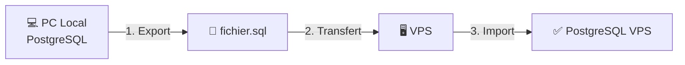

# 📦 Guide : Importer Manuellement la Base de Données

Ce guide vous montre comment exporter votre base de données PostgreSQL locale et l'importer sur le VPS.

---

## 🎯 Vue d'ensemble


```mermaid
graph LR
    A[💻 PC Local<br/>PostgreSQL] -->|1. Export| B[📄 fichier.sql]
    B -->|2. Transfert| C[🖥️ VPS]
    C -->|3. Import| D[✅ PostgreSQL VPS]
```

---

## 📤 PARTIE 1 : EXPORT DE LA BASE DE DONNÉES (Sur votre PC)

### Option A : Avec pgAdmin (Interface Graphique)

1. **Ouvrir pgAdmin**
2. **Se connecter** à votre serveur PostgreSQL
3. **Clic droit** sur la base de données `ge_cfpm`
4. **Backup...**
5. Choisir :
   - **Filename** : `ge_cfpm_backup.sql`
   - **Format** : Plain (SQL)
   - **Encoding** : UTF8
6. Cliquer sur **Backup**

### Option B : Avec la ligne de commande (Recommandé)

**Sur Windows PowerShell :**

```powershell
# Aller dans le dossier où vous voulez sauvegarder
cd d:\

# Exporter la base de données
# Remplacer le chemin de pg_dump si nécessaire
& "C:\Program Files\PostgreSQL\14\bin\pg_dump.exe" -U postgres -h localhost -d ge_cfpm -F p -f ge_cfpm_backup.sql

# Entrer votre mot de passe PostgreSQL quand demandé
```

**Alternative si pg_dump est dans le PATH :**

```powershell
pg_dump -U postgres -h localhost -d ge_cfpm -F p -f ge_cfpm_backup.sql
```

**Vérifier que le fichier est créé :**

```powershell
ls ge_cfpm_backup.sql
```

---

## 📁 PARTIE 2 : TRANSFERT DU FICHIER VERS LE VPS

### Option A : Avec SCP (Ligne de commande)

**Sur Windows PowerShell :**

```powershell
# Transférer le fichier vers le VPS
scp d:\ge_cfpm_backup.sql root@VOTRE_IP_VPS:/tmp/

# Exemple:
# scp d:\ge_cfpm_backup.sql root@192.168.1.100:/tmp/
```

### Option B : Avec FileZilla (Interface Graphique)

1. **Ouvrir FileZilla**
2. **Se connecter au VPS :**
   - Hôte : `sftp://VOTRE_IP_VPS`
   - Utilisateur : `root`
   - Mot de passe : votre mot de passe VPS
   - Port : `22`
3. **Naviguer** vers `/tmp/` sur le serveur (panneau droit)
4. **Glisser-déposer** le fichier `ge_cfpm_backup.sql`

### Option C : Avec WinSCP (Windows)

1. **Ouvrir WinSCP**
2. **Nouvelle session :**
   - Protocole : SFTP
   - Nom d'hôte : `VOTRE_IP_VPS`
   - Utilisateur : `root`
   - Mot de passe : votre mot de passe
3. **Se connecter**
4. **Copier** `ge_cfpm_backup.sql` vers `/tmp/`

---

## 📥 PARTIE 3 : IMPORT SUR LE VPS

**Sur le VPS (via SSH) :**

### 3.1 Vérifier que le fichier est bien là

```bash
ls -lh /tmp/ge_cfpm_backup.sql
```

### 3.2 Créer la base de données (si pas déjà fait)

```bash
# Se connecter à PostgreSQL
sudo -u postgres psql

# Créer la base (si elle n'existe pas)
CREATE DATABASE ge_cfpm;

# Créer l'utilisateur (si pas déjà fait)
CREATE USER postgres WITH PASSWORD 'VotreMotDePasseFort';
ALTER USER postgres WITH SUPERUSER;
GRANT ALL PRIVILEGES ON DATABASE ge_cfpm TO postgres;

# Quitter
\q
```

### 3.3 Importer la base de données

```bash
# Importer le fichier SQL
sudo -u postgres psql -d ge_cfpm -f /tmp/ge_cfpm_backup.sql
```

**Si vous avez configuré un mot de passe pour l'utilisateur postgres :**

```bash
# Avec mot de passe
PGPASSWORD='VotreMotDePasseFort' psql -U postgres -h localhost -d ge_cfpm -f /tmp/ge_cfpm_backup.sql
```

### 3.4 Vérifier l'import

```bash
# Se connecter à la base
sudo -u postgres psql -d ge_cfpm

# Lister les tables
\dt

# Compter les enregistrements (exemple)
SELECT COUNT(*) FROM users;
SELECT COUNT(*) FROM etudiants;
SELECT COUNT(*) FROM paiements;

# Quitter
\q
```

### 3.5 Nettoyer (optionnel)

```bash
# Supprimer le fichier SQL du serveur (si vous voulez)
rm /tmp/ge_cfpm_backup.sql
```

---

## ⚠️ ALTERNATIVE : Import avec Compression

Si votre base de données est très volumineuse, vous pouvez la compresser.

### Sur votre PC :

```powershell
# Export avec compression
& "C:\Program Files\PostgreSQL\14\bin\pg_dump.exe" -U postgres -h localhost -d ge_cfpm -F c -f ge_cfpm_backup.dump

# Transférer
scp ge_cfpm_backup.dump root@VOTRE_IP_VPS:/tmp/
```

### Sur le VPS :

```bash
# Import avec pg_restore
sudo -u postgres pg_restore -d ge_cfpm /tmp/ge_cfpm_backup.dump

# Ou avec mot de passe
PGPASSWORD='VotreMotDePasseFort' pg_restore -U postgres -h localhost -d ge_cfpm /tmp/ge_cfpm_backup.dump
```

---

## 🔄 SCRIPT AUTOMATISÉ

### Sur votre PC (export.ps1)

```powershell
# export.ps1
$date = Get-Date -Format "yyyyMMdd_HHmmss"
$filename = "ge_cfpm_backup_$date.sql"

Write-Host "Export de la base de données..."
& "C:\Program Files\PostgreSQL\14\bin\pg_dump.exe" -U postgres -h localhost -d ge_cfpm -F p -f $filename

Write-Host "Compression..."
Compress-Archive -Path $filename -DestinationPath "$filename.zip"

Write-Host "✅ Backup créé: $filename.zip"
Write-Host "📤 Transférer ce fichier vers le VPS"
```

### Sur le VPS (import.sh)

```bash
#!/bin/bash
# import.sh

SQL_FILE=$1

if [ -z "$SQL_FILE" ]; then
    echo "Usage: ./import.sh <fichier.sql>"
    exit 1
fi

echo "🗄️ Import de la base de données..."

# Backup de sécurité avant import
echo "📦 Backup de sécurité..."
sudo -u postgres pg_dump ge_cfpm > /tmp/ge_cfpm_backup_before_import.sql

# Import
echo "📥 Import en cours..."
sudo -u postgres psql -d ge_cfpm -f "$SQL_FILE"

echo "✅ Import terminé!"

# Vérification
echo "📊 Statistiques:"
sudo -u postgres psql -d ge_cfpm -c "\dt"
```

**Utilisation :**

```bash
chmod +x import.sh
./import.sh /tmp/ge_cfpm_backup.sql
```

---

## 🔍 VÉRIFICATIONS POST-IMPORT

### 1. Vérifier les tables

```bash
sudo -u postgres psql -d ge_cfpm -c "\dt"
```

### 2. Vérifier les données

```bash
sudo -u postgres psql -d ge_cfpm << EOF
SELECT 'users' as table_name, COUNT(*) as count FROM users
UNION ALL
SELECT 'centres', COUNT(*) FROM centres
UNION ALL
SELECT 'formations', COUNT(*) FROM formations
UNION ALL
SELECT 'etudiants', COUNT(*) FROM etudiants
UNION ALL
SELECT 'inscriptions', COUNT(*) FROM inscriptions
UNION ALL
SELECT 'paiements', COUNT(*) FROM paiements;
EOF
```

### 3. Vérifier les permissions

```bash
sudo -u postgres psql -d ge_cfpm -c "\du"
```

### 4. Tester l'application

```bash
# Redémarrer le backend
pm2 restart cfpm-backend

# Voir les logs
pm2 logs cfpm-backend

# Tester l'API
curl http://localhost:5000/api/users
```

---

## 🐛 DÉPANNAGE

### Erreur : "role does not exist"

```bash
# Créer l'utilisateur
sudo -u postgres psql -c "CREATE USER postgres WITH PASSWORD 'VotreMotDePasseFort';"
sudo -u postgres psql -c "ALTER USER postgres WITH SUPERUSER;"
```

### Erreur : "database already contains data"

```bash
# Option 1: Supprimer et recréer la base
sudo -u postgres psql -c "DROP DATABASE ge_cfpm;"
sudo -u postgres psql -c "CREATE DATABASE ge_cfpm;"
# Puis réimporter

# Option 2: Nettoyer les tables
sudo -u postgres psql -d ge_cfpm -c "DROP SCHEMA public CASCADE;"
sudo -u postgres psql -d ge_cfpm -c "CREATE SCHEMA public;"
# Puis réimporter
```

### Erreur de permission

```bash
sudo -u postgres psql -d ge_cfpm -c "GRANT ALL PRIVILEGES ON ALL TABLES IN SCHEMA public TO postgres;"
sudo -u postgres psql -d ge_cfpm -c "GRANT ALL PRIVILEGES ON ALL SEQUENCES IN SCHEMA public TO postgres;"
```

---

## 📝 RÉSUMÉ RAPIDE

**Sur votre PC :**
```powershell
pg_dump -U postgres -h localhost -d ge_cfpm -F p -f ge_cfpm_backup.sql
scp ge_cfpm_backup.sql root@VOTRE_IP:/tmp/
```

**Sur le VPS :**
```bash
sudo -u postgres psql -d ge_cfpm -f /tmp/ge_cfpm_backup.sql
sudo -u postgres psql -d ge_cfpm -c "\dt"
pm2 restart cfpm-backend
```

---

## ✅ Après l'import

1. ✅ Les données sont importées
2. ✅ Le backend peut se connecter
3. ✅ L'application fonctionne
4. ✅ **NE PAS exécuter** `npm run migrate:prod` si vous avez importé manuellement

---

**Votre base de données est maintenant sur le VPS ! 🎉**
